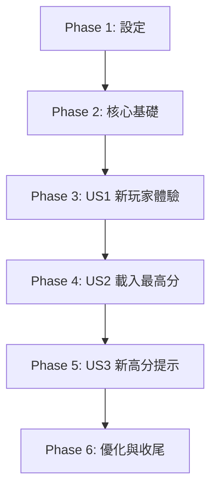

# 開發任務清單：視窗版繁體中文貪食蛇遊戲

本文件將整個開發過程分解為一系列具體、可執行的任務。

---

## Phase 1: 專案設定

*目標：建立專案的基礎架構和環境。*

- [X] T001 建立 `src` 和 `src/assets` 目錄結構於 `貪食蛇2/`
- [X] T002 在 `貪食蛇2/` 目錄下，使用 `uv add pygame` 安裝 Pygame
- [X] T003 建立 `貪食蛇2/src/settings.py` 檔案，並定義螢幕尺寸、顏色等基本常數
- [X] T004 建立 `貪食蛇2/src/main.py` 檔案，並撰寫一個能成功開啟空白 Pygame 視窗的基本迴圈

---

## Phase 2: 核心功能基礎

*目標：實作所有使用者故事都依賴的核心模組。*

- [X] T005 [P] 在 `貪食蛇2/src/player.py` 中實作 `ScoreManager` 類別，包含 `load_scores`, `get_high_score`, `update_score` 方法，用於處理 `assets/scores.json`
- [X] T006 [P] 在 `貪食蛇2/src/ui.py` 中實作 `draw_text` 輔助函式，用於在螢幕上渲染文字
- [X] T007 在 `貪食蛇2/src/main.py` 中建立基礎狀態機邏輯，並定義 `MainMenu`, `Game`, `GameOver` 等狀態的空類別或函式作為佔位符

---

## Phase 3: 使用者故事 1 - 新玩家的完整遊戲體驗

*目標：讓一個新玩家可以從頭到尾玩一局完整的遊戲。*

- **獨立測試標準**: 啟動遊戲，輸入一個新玩家名稱，能正常遊玩直到蛇死亡，遊戲結束後，分數被正確記錄到 `scores.json` 中。

- [X] T008 [US1] 在 `貪食蛇2/src/ui.py` 中實作 `get_player_name` 畫面，讓使用者可以輸入名稱
- [X] T009 [US1] 在 `貪食蛇2/src/ui.py` 中實作 `draw_main_menu` 畫面，並包含「開始遊戲」按鈕
- [X] T010 [US1] 在 `貪食蛇2/src/game.py` 中建立 `Game` 類別，並實作 `Snake` 和 `Food` 的基本資料結構
- [X] T011 [US1] 在 `貪食蛇2/src/game.py` 中實作遊戲的核心更新邏輯 (`_update_logic`)，包含蛇的移動、吃食物、邊界與自身碰撞偵測
- [X] T012 [US1] 在 `貪食蛇2/src/game.py` 中實作遊戲的繪圖邏輯 (`_draw_elements`)，將蛇、食物和目前分數渲染到畫面上
- [X] T013 [US1] 在 `貪食蛇2/src/ui.py` 中實作 `draw_game_over_screen` 畫面，顯示最終分數並提供「重新開始」選項
- [X] T014 [US1] 在 `貪食蛇2/src/main.py` 中整合所有 UI 畫面和遊戲邏輯，完成狀態機的串接

---

## Phase 4: 使用者故事 2 - 現有玩家載入最高分

*目標：現有玩家登入時，能看到自己的最高分。*

- **獨立測試標準**: 使用已存在的玩家名稱啟動遊戲，確認遊戲畫面中顯示的「最高紀錄」為正確的數值。

- [X] T015 [P] [US2] 修改 `貪食蛇2/src/main.py`，在玩家輸入名稱後，使用 `ScoreManager` 獲取其最高分
- [X] T016 [US2] 修改 `貪食蛇2/src/game.py` 的 `Game` 類別，使其在初始化時接收並在畫面上顯示傳入的最高分

---

## Phase 5: 使用者故事 3 - 即時新高分提示

*目標：玩家在遊戲中打破紀錄時能立即收到提示。*

- **獨立測試標準**: 作為現有玩家開始遊戲，當目前分數超過歷史最高分時，畫面上立即出現提示文字。

- [X] T017 [P] [US3] 在 `貪食蛇2/src/game.py` 的 `_update_logic` 中增加邏輯，檢查目前分數是否剛超過歷史最高分
- [X] T018 [US3] 在 `貪食蛇2/src/game.py` 的 `_draw_elements` 中增加邏輯，當滿足新高分條件時，在畫面上繪製提示文字

---

## Phase 6: 優化與收尾

*目標：進行最終的程式碼整理、增加音效並建立說明文件。*

- [X] T019 [P] 尋找或建立簡單的背景音樂和音效檔案，並將它們整合到遊戲中（例如：吃食物、遊戲結束）
- [X] T020 [P] 建立 `貪食蛇2/README.md`，說明如何設定環境和執行遊戲
- [X] T021 完整審查專案程式碼，確保遵循 PEP 8 規範，並為複雜部分添加必要的繁體中文註解

---

## 依賴關係圖

## 實作策略

我們將採用 MVP（最小可行性產品）優先的策略。首要目標是完成 **Phase 3**，交付一個功能完整、可玩的遊戲。後續的 Phase 4 和 5 是在此基礎上的功能增強。每個 Phase（特別是代表使用者故事的 Phase）都應被視為一個可以獨立測試的交付單位。
